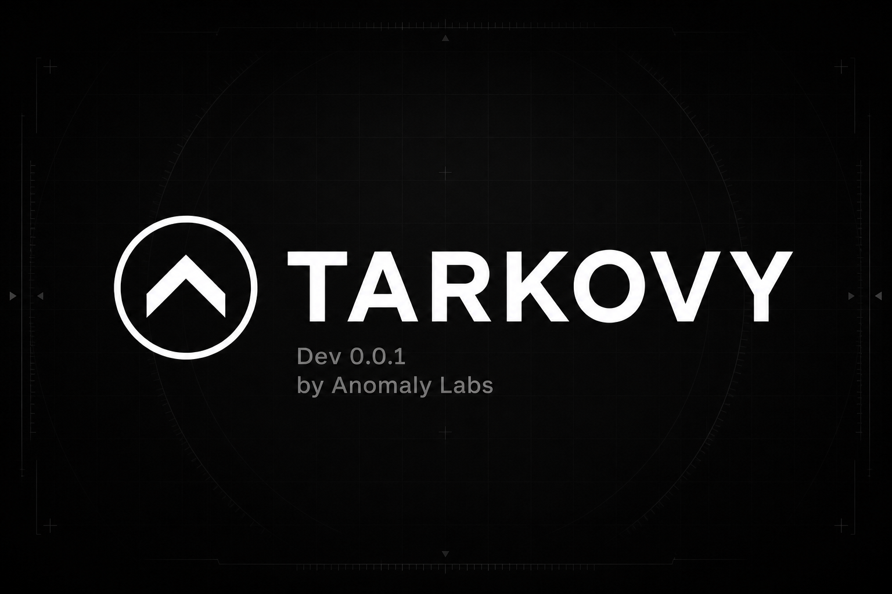
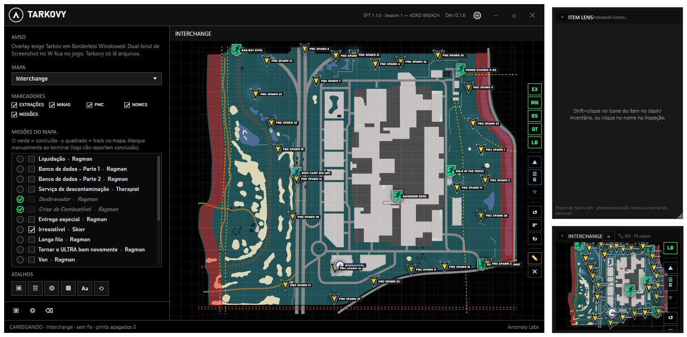

# TARKOVY · Dev 0.1.38

**Minimap overlay companion for Escape from Tarkov**  
by **Anomaly Labs**

<p align="left">
  <a href="https://github.com/leandrovieiraa/Tarkovy/releases"></a>&nbsp;&nbsp;&nbsp;&nbsp;
  <a href="https://www.escapefromtarkov.com/"></a>&nbsp;&nbsp;&nbsp;&nbsp;
  <a href="#requirements"></a>&nbsp;&nbsp;&nbsp;&nbsp;
  <a href="#build"></a>
  <br/><br/>
  <a href="#credits"></a>&nbsp;&nbsp;&nbsp;&nbsp;
  <a href="https://www.virustotal.com/gui/file/862BBDA0BAB2B51700F45FA89D3CEE4E294E6F117419313015403D7FF93D383B"></a>&nbsp;&nbsp;&nbsp;&nbsp;
  <a href="https://buymeacoffee.com/anomalylabs"></a>&nbsp;&nbsp;&nbsp;&nbsp;
  <a href="mailto:anomalylabstudio@gmail.com"></a>
</p>

[Overview](#overview) · [Features](#features) · [Download](#download) · [Report a bug](#report-a-bug) · [Support](#support) · [Buy me a beer](#buy-me-a-beer) · [Interface](#interface) · [Requirements](#requirements) · [Usage](#usage) · [Screenshot bind](#screenshot-bind) · [Build](#build) · [Virus scan](#virus-scan) · [Changelog](#changelog) · [License](#license--terms-of-use) · [Credits](#credits)

---

## Overview

**Tarkovy** is a **Windows** companion for [Escape from Tarkov](https://www.escapefromtarkov.com/). A tactical minimap overlay that only reads what the game already writes to disk:

- application logs (map / raid state)
- screenshot **filenames** (coordinates + heading)

No memory reading, no injection, no client modification.


|                  |                                  |
| ---------------- | -------------------------------- |
| **Product**      | Tarkovy                          |
| **Version**      | **Dev 0.1.38**                   |
| **EFT target**   | **1.1.0** (`1.1.0.1.46699`) · Season 1 **KORD BREACH** (Aug 2026) |
| **Studio**       | Anomaly Labs                     |
| **Stack**        | .NET 8 · WPF · WebView2          |
| **Distribution** | `Tarkovy.exe` single-file (~115 MB, self-contained) |


> **Disclaimer** — Not affiliated with Battlestate Games. Use at your own risk; BSG rules may change.

> **Game compatibility** — Quest names, map SVGs, extracts, and screenshot filename parsing were validated against **Escape from Tarkov 1.1.0** (Season 1 — KORD BREACH). A major EFT update can change any of that; the target patch is also shown in the app header.

---

## Features


|                                                                        | Feature              | Detail                                                                 |
| ---------------------------------------------------------------------- | -------------------- | ---------------------------------------------------------------------- |
|         | Map detection        | Reads `application.log` and swaps the SVG automatically                |
|    | Position + heading   | Parses the EFT screenshot filename                                     |
|   | Follow player        | Minimap zooms in and tracks you as screenshots update                  |
|     | Overlay HUD          | Compact minimap (`F8`, off by default); optional exits panel (`F9`); min **260×180** |
|      | Item Lens            | Shift+click stash/inventory icon (game icon cache + templates; AI only if local scan fails), or **search by name**; flea/trader/slot prices from tarkov.dev — **F10** |
|    | Pencil waypoint      | ✎ click anywhere on map or minimap — route line to your position      |
|   | Map floors           | ▲▼ layer switch (Factory, Interchange, Ground Zero); auto from Y      |
|  | Extracts & mines     | Toggleable layers + click extract to set a waypoint                    |
|      | PMC spawns           | Toggleable respawn markers (cyan triangles) per map                    |
|    | Map quest catalog    | Track missions; mark complete (○) to hide markers and stop tracking   |
|   | Side tools           | **◎** eye toggle · EX / MN / RS / QT / LB · floors · ✎ waypoint · rotation — layout adapts to window size |
|    | Game-style markers   | tarkov.dev icons per type (PMC/Scav exfil, hazard, spawn, quest…)   |
|   | Window layout        | Remembers position and size for main window, minimap, and Item Lens    |
|       | EN / PT UI           | App + quest titles follow your language setting                        |
|   | Screenshot cleanup   | Deletes the print after reading (and sweeps leftovers at raid end)     |
|       | Safe approach        | Logs, screenshots, and screen capture only — no memory read / inject   |


> Quests are a **map catalog** you toggle manually. Tarkov logs do not expose your live PMC journal.

---

## Download

Grab the latest **`Tarkovy.exe`** from [GitHub Releases](https://github.com/leandrovieiraa/Tarkovy/releases) and run it. No install, no extra folders — map assets unpack to `%AppData%` on first launch.

---

## Report a bug

Found something broken? Please open a GitHub Issue — we want the reports.

1. Go to **[Issues → New issue](https://github.com/leandrovieiraa/Tarkovy/issues/new)**
2. Describe what you expected vs what happened
3. Include **EFT version** (see in-game / Tarkovy header target) and **Tarkovy version** (`Dev 0.1.38`)
4. **Attach screenshots or short clips** of the main window, overlay, and/or the in-game situation — images help a lot
5. Steps to reproduce if you have them

For general questions or feedback (not a bug report), see **[Support](#support)**.

---

## Support

[](mailto:anomalylabstudio@gmail.com)

Questions, feedback, or collaboration? Reach out at **[anomalylabstudio@gmail.com](mailto:anomalylabstudio@gmail.com)**.

For bugs and crashes, prefer **[GitHub Issues](#report-a-bug)** so we can track fixes with screenshots and repro steps.

---

## Buy me a beer

Long raids, cold hops, and map SVG wrestling — that’s the Anomaly Labs diet.

If Tarkovy saved you a death or two (or just made the mall less confusing), you can [**buy me a craft beer**](https://buymeacoffee.com/anomalylabs) on Buy Me a Coffee. IPA, stout, sour, whatever’s on tap — much appreciated.

[](https://buymeacoffee.com/anomalylabs)

*No pressure. Shipping pixels is already fun. Beer just makes the next patch notes easier to read.*

---

## Interface



*Main window — map preview, markers, and controls · Anomaly Labs*

[Item Lens Showcase](https://vimeo.com/1222815532) (Dev 0.1.33)

---

## Requirements

- Windows 10 / 11
- Escape from Tarkov in **Borderless Windowed** (exclusive fullscreen hides any overlay)
- [WebView2 Runtime](https://developer.microsoft.com/microsoft-edge/webview2/) (usually already installed on Windows)

**UI languages:** English (default) and Portuguese — switch in **CONFIG → Language**.

---

## Usage

1. Download `Tarkovy.exe` and run it
2. Open **CONFIG** (gear in the header) and set your folders:
  - **Logs:** `<EFT install>\Logs` (example: `D:\Battlestate Games\Escape from Tarkov\Logs`)
  - **Screenshots:** `Documents\Escape from Tarkov\Screenshots`
3. Bind **Screenshot** in EFT (see [Screenshot bind](#screenshot-bind)) — middle mouse or a quick side key works well
4. Enter a raid — the map switches automatically; each screenshot updates the arrow and the file is removed
5. Hotkeys:
  - **F8** — show / hide minimap overlay (off by default)
  - **F9** — toggle optional exits/quests side panel on the minimap (stays compact)
  - **F10** — show / hide Item Lens
6. **Item Lens:** enable click-to-scan in **CONFIG** → **Shift+click** the **center** of the item icon in stash/inventory (item must be highlighted) → prices panel opens (first run indexes icons from tarkov.dev). The icon scan **will miss or misidentify** some items (ammo, guns, similar icons) — use **Item Search** at the bottom of the panel. See [Item Lens limitations](#item-lens-limitations).
7. **Waypoint:** click **✎** on the map toolbar → click destination on the full map or minimap → yellow route line toward your position. **✕** clears it. **Esc** cancels pencil mode.

On first run, assets are extracted to `%AppData%\Tarkovy`. Windows may show SmartScreen: *More info* → *Run anyway*.

### Item Lens limitations

Icon scan is **best-effort** (screen capture only — no memory read). It **will not** identify every item. When it misses or looks wrong, type the name in **Item Search** at the bottom of the panel (PT and EN).

| | |
| --- | --- |
| **Use search** | Ammo, modded guns, and look-alike 1×1 icons are the usual misses. Search is the reliable path. |
| **Weapons** | Modded guns cannot be identified reliably. Attachments change the icon; Tarkovy only has static tarkov.dev stills. |
| **Equipment** | Some helmets/rigs/armor share similar silhouettes. |
| **Durability / uses** | Not read from the slot. Flea and trader prices are catalog averages for a **full** item (CMS 5/5, water 60/60, etc.). |
| **Shared icons** | Keys and other items that reuse the same picture can collide. The panel may refuse the match instead of guessing. |
| **Stash light** | Icons at the **top-left** of the stash sit under the bright lamp at the top of the screen. That wash-out breaks highlight detection — expect misses there. |

Also:

- **Shift+click the grid icon**, not the inspect-window magnifying glass.
- Unique in-cell labels (**CMS**, **Água**, **Esmarch**) scan more reliably than generic ammo packs.
- **Item Search** looks up PT and EN names from tarkov.dev — same idea as a search bar, for anything the icon scan cannot resolve.

---

## Screenshot bind

Tarkovy does **not** simulate key presses. It only reads the **filename** EFT writes when you take an **in-game screenshot** (coordinates + heading).

### In Escape from Tarkov

1. **Settings** → **Controls**
2. Find **Screenshot** (not Windows Print Screen)
3. Bind it to something you can hit **while moving** without breaking gameplay
4. Keep the game in **Borderless Windowed**

### Suggested binds

- **Middle mouse button (scroll wheel click)** — easy to tap while holding **W**; doesn’t steal a keyboard key
- **A dedicated key nearby** — e.g. **C**, **V**, **X**, or a thumb mouse button — whatever feels fastest for you
- **Tap as you go** — press your screenshot bind every few steps while rotating; no perfect rhythm needed, just fresh prints when the arrow drifts

Pick what fits your hand and mouse.

### In-raid flow

Your bind → EFT saves a screenshot → Tarkovy reads X/Y/Z + yaw from the filename → updates the arrow → **deletes the file** (if cleanup is enabled).

### Notes

- The screenshot flash/toast is from EFT, not Tarkovy
- Windows Print Screen alone will **not** work: Tarkovy needs the **in-game** screenshot filename with coordinates

---

## Build

### Publish

Requires [.NET 8 SDK](https://dotnet.microsoft.com/download):

```powershell
dotnet publish src\Tarkovy\Tarkovy.csproj -c Release -r win-x64 --self-contained true -p:PublishSingleFile=true -p:IncludeNativeLibrariesForSelfExtract=true -o dist
```

Output: `dist\Tarkovy.exe` only (single-file, self-contained). Map JSON/HTML/icons are embedded and copy to `%AppData%\Tarkovy\assets` on first run.

For GitHub Releases you can upload **`Tarkovy.exe` directly** — no ZIP required. Zip only if you prefer a smaller download page artifact or your host requires it.

### Development

```powershell
dotnet run --project src\Tarkovy\Tarkovy.csproj
```

---

## Virus scan

Official builds are meant to be checked on [VirusTotal](https://www.virustotal.com/) before you run them. Windows SmartScreen may still warn on unsigned apps — that is normal for new open-source tools.

### Automated scan (local API key)

Zip the current `dist\` folder and upload via the [VirusTotal files API](https://docs.virustotal.com/reference/files-scan) (large builds use [upload_url](https://docs.virustotal.com/reference/files-upload-url)). The API key stays **only on your machine**.

Since `dist\` is a single exe, prefer **`-ExeOnly`** (uploads `Tarkovy.exe` directly, no zip step).

```powershell
# once
copy tools\vt.local.env.example tools\vt.local.env
# edit tools\vt.local.env → VT_API_KEY=...

# publish + upload Tarkovy.exe
.\tools\publish-and-vt.ps1 -Wait -ExeOnly

# or scan an existing dist\ without rebuilding
.\tools\vt-scan-dist.ps1 -Wait -ExeOnly
```

`tools\vt.local.env` and `tools\_vt-out\` are gitignored.

### Release `v0.1.38` (`Tarkovy.exe`)


|                |                                                                                                                                      |
| -------------- | ------------------------------------------------------------------------------------------------------------------------------------ |
| **Download**   | [Tarkovy.exe (GitHub Release)](https://github.com/leandrovieiraa/Tarkovy/releases/download/v0.1.38/Tarkovy.exe)                        |
| **VirusTotal** | [Open scan report](https://www.virustotal.com/gui/file/862BBDA0BAB2B51700F45FA89D3CEE4E294E6F117419313015403D7FF93D383B)             |
| **SHA-256**    | `862BBDA0BAB2B51700F45FA89D3CEE4E294E6F117419313015403D7FF93D383B`                                                                   |

<details>
<summary><strong>Previous releases</strong></summary>

### `v0.1.33` (`Tarkovy.exe`)

|                |                                                                                                                                      |
| -------------- | ------------------------------------------------------------------------------------------------------------------------------------ |
| **Download**   | [Tarkovy.exe (GitHub Release)](https://github.com/leandrovieiraa/Tarkovy/releases/download/v0.1.33/Tarkovy.exe)                        |
| **VirusTotal** | [Open scan report](https://www.virustotal.com/gui/file/F1431CB82CE4699D1DB800E66C948CAB17AB938DF95455036C48DEB087B3A0F6)             |
| **SHA-256**    | `F1431CB82CE4699D1DB800E66C948CAB17AB938DF95455036C48DEB087B3A0F6`                                                                   |

### `v0.1.10` (`Tarkovy.exe`)

|                |                                                                                                                                      |
| -------------- | ------------------------------------------------------------------------------------------------------------------------------------ |
| **Download**   | [Tarkovy.exe (GitHub Release)](https://github.com/leandrovieiraa/Tarkovy/releases/download/v0.1.10/Tarkovy.exe)                        |
| **VirusTotal** | [Open scan report](https://www.virustotal.com/gui/file/C4AAF760C9F7D149E4AFB71BC6FDF2A4A17DC12C122A7B748BAA521FCC5BA9CD)             |
| **SHA-256**    | `C4AAF760C9F7D149E4AFB71BC6FDF2A4A17DC12C122A7B748BAA521FCC5BA9CD`                                                                   |

### `v0.1.9` (`Tarkovy.exe`)

|                |                                                                                                                                      |
| -------------- | ------------------------------------------------------------------------------------------------------------------------------------ |
| **Download**   | [Tarkovy.exe (GitHub Release)](https://github.com/leandrovieiraa/Tarkovy/releases/download/v0.1.9/Tarkovy.exe)                         |
| **VirusTotal** | [Open scan report](https://www.virustotal.com/gui/file/FE27893037D3486F59BEEFA92D9A795B53161D6947E404DEDF02B1C20325C56E)             |
| **SHA-256**    | `FE27893037D3486F59BEEFA92D9A795B53161D6947E404DEDF02B1C20325C56E`                                                                   |

### `v0.1.8` (`Tarkovy.exe`)

|                |                                                                                                                                      |
| -------------- | ------------------------------------------------------------------------------------------------------------------------------------ |
| **Download**   | [Tarkovy.exe (GitHub Release)](https://github.com/leandrovieiraa/Tarkovy/releases/download/v0.1.8/Tarkovy.exe)                         |
| **VirusTotal** | [Open scan report](https://www.virustotal.com/gui/file/256AF12CC4F3E6CBB15DC78B30B5811AEDB311047DA349178BAD67237AFCE606)             |
| **SHA-256**    | `256AF12CC4F3E6CBB15DC78B30B5811AEDB311047DA349178BAD67237AFCE606`                                                                   |

### `v0.1.6` (`Tarkovy-0.1.6.zip`)

|                |                                                                                                                                      |
| -------------- | ------------------------------------------------------------------------------------------------------------------------------------ |
| **Download**   | [Tarkovy-0.1.6.zip (GitHub Release)](https://github.com/leandrovieiraa/Tarkovy/releases/download/v0.1.6/Tarkovy-0.1.6.zip)           |
| **VirusTotal** | [Open scan report](https://www.virustotal.com/gui/file/86D524EFDDC02E6DE6CD3444C66EE65145F7B0446D531165B7E16B5031584C87)             |
| **SHA-256**    | `86D524EFDDC02E6DE6CD3444C66EE65145F7B0446D531165B7E16B5031584C87`                                                                   |

### `v0.0.6` (`Tarkovy-0.0.6.zip`)

|                |                                                                                                                                      |
| -------------- | ------------------------------------------------------------------------------------------------------------------------------------ |
| **Download**   | [Tarkovy-0.0.6.zip (GitHub Release)](https://github.com/leandrovieiraa/Tarkovy/releases/download/v0.0.6/Tarkovy-0.0.6.zip)           |
| **VirusTotal** | [Open scan report](https://www.virustotal.com/gui/file/B618044EAE6E3CE737E3F23F0098D6682AE2DFDFA7316560F80EBE613393D3C3)             |
| **SHA-256**    | `B618044EAE6E3CE737E3F23F0098D6682AE2DFDFA7316560F80EBE613393D3C3`                                                                   |

### `v0.0.5` (`Tarkovy-0.0.5.zip`)

|                |                                                                                                                                      |
| -------------- | ------------------------------------------------------------------------------------------------------------------------------------ |
| **Download**   | [Tarkovy-0.0.5.zip (GitHub Release)](https://github.com/leandrovieiraa/Tarkovy/releases/download/v0.0.5/Tarkovy-0.0.5.zip)           |
| **VirusTotal** | [Open scan report](https://www.virustotal.com/gui/file/C9F4ECD092DB921B7BC8BDD93BC90BDD5B6876ABACD5864C2C3E993162126E89)             |
| **SHA-256**    | `C9F4ECD092DB921B7BC8BDD93BC90BDD5B6876ABACD5864C2C3E993162126E89`                                                                   |

### `v0.0.4` (`Tarkovy-0.0.4.zip`)

|                |                                                                                                                                      |
| -------------- | ------------------------------------------------------------------------------------------------------------------------------------ |
| **Download**   | [Tarkovy-0.0.4.zip (GitHub Release)](https://github.com/leandrovieiraa/Tarkovy/releases/download/v0.0.4/Tarkovy-0.0.4.zip)           |
| **VirusTotal** | [Open scan report](https://www.virustotal.com/gui/file/A920FD6B30904039743F258A5B8F5EE40BF9CC31ECF8F362048C752F4337A400)             |
| **SHA-256**    | `A920FD6B30904039743F258A5B8F5EE40BF9CC31ECF8F362048C752F4337A400`                                                                   |

### `v0.0.3` (`Tarkovy-0.0.3.zip`)

|                |                                                                                                                                      |
| -------------- | ------------------------------------------------------------------------------------------------------------------------------------ |
| **Download**   | [Tarkovy-0.0.3.zip (GitHub Release)](https://github.com/leandrovieiraa/Tarkovy/releases/download/v0.0.3/Tarkovy-0.0.3.zip)           |
| **VirusTotal** | [Open scan report](https://www.virustotal.com/gui/file/10828E02BC0806C32E32181ECD86394BEE678AB23EC0B5F7A2D1F3D336B2DA1D)             |
| **SHA-256**    | `10828E02BC0806C32E32181ECD86394BEE678AB23EC0B5F7A2D1F3D336B2DA1D`                                                                   |

### `v0.0.2` (`Tarkovy.exe`)

|                |                                                                                                                                      |
| -------------- | ------------------------------------------------------------------------------------------------------------------------------------ |
| **Download**   | [Tarkovy.exe (GitHub Release)](https://github.com/leandrovieiraa/Tarkovy/releases/download/v0.0.2/Tarkovy.exe)                       |
| **VirusTotal** | [Open scan report](https://www.virustotal.com/gui/file/46f5026d6bfbfaee7f2510edb3a78fa3323c0828341c4d296b07558874655f35) |
| **SHA-256**    | `F36744FE4E6EC06F83191B294B58E182CAD8C6B81946A9A66103FE9E63F78D69`                                                                   |

</details>

Verify locally (PowerShell):

```powershell
Get-FileHash .\Tarkovy.exe -Algorithm SHA256
```

> Prefer the **GitHub Releases** build. Rebuilds change the hash — scan that file again.

---

## Changelog

<details open>
<summary><strong>Dev 0.1.38</strong> (latest)</summary>

- **Item Lens** — local scan uses the EFT icon cache + catalog templates (OpenCV) and Tesseract for inspect titles; optional AI is last-resort only
- **Fix** — Shift+click no longer trusts a garbage tooltip (`MS?BBO` → Zibbo) when the highlighted cell is a larger item (CMS, kits); prefers the full grid cell and icon match

</details>

<details>
<summary><strong>Dev 0.1.37</strong></summary>

- **UI** — MARKERS panel uses aligned toggle chips and equal-width CLEAN / RAID / LOOT RUN presets

</details>

<details>
<summary><strong>Dev 0.1.36</strong></summary>

- **Fix** — toggling map markers (extracts, mines, PMC, names, loot, bosses, locs) no longer rebuilds the whole map; layers hide with CSS and loot is clustered

</details>

<details>
<summary><strong>Dev 0.1.35</strong></summary>

- **Fix** — LOCS / LOOT / BOSSES checkboxes no longer freeze the app (filter-only map update, no full marker rebuild)

</details>

<details>
<summary><strong>Dev 0.1.34</strong></summary>

- **Map POIs** — loot, bosses, and locations off by default; enable from the main window (LOOT / BOSSES / LOCS, CLEAN / RAID / LOOT RUN, POIs tab) or overlay chips LT / BS / LC

</details>

<details>
<summary><strong>Dev 0.1.33</strong></summary>

- **Item Lens** — icon scan is best-effort; it can miss or misidentify items (ammo, guns, similar icons). **Use Item Search** in the panel when that happens (PT/EN).
- Config drawer on the right, optional AI fallback, OCR/tooltip matching, highlight crop, and stash click scan improvements since 0.1.10.

</details>

<details>
<summary><strong>Dev 0.1.10</strong></summary>

- **Hotfix** — mouse lag on startup and while moving the cursor (removed global low-level mouse hook; item scan uses lightweight click polling instead)
- **Startup** — WebView2 warms up in background after loading dismisses; item scan and overlay deferred a few seconds
- **MapView** — non-blocking message queue to WebView2

</details>

<details>
<summary><strong>Dev 0.1.9</strong></summary>

- **Hotfix** — loading screen no longer hangs forever (WebView2 init moved after overlay dismisses)

</details>

<details>
<summary><strong>Dev 0.1.8</strong></summary>

- **Quest search** — filter map quests by name or trader (🔍 in the quest panel header)
- **Compact quest legend** — hint text moved to an **i** info tooltip
- **Single-file release** — one self-contained `Tarkovy.exe` (~115 MB); assets unpack to `%AppData%` on first run
- **Startup loading** — full-window blur snapshot + spinner (min 2s) while assets warm up

</details>

<details>
<summary><strong>Dev 0.1.6</strong></summary>

- **Item Lens** — click-to-scan like RatScanner: Shift+click stash/inventory icon, click inspect name (OCR); flea/trader/slot prices from tarkov.dev (screen capture only, no memory read)
- **F10** — show/hide Item Lens overlay (same white border as the minimap)
- Compact shortcut chips on the main window (tooltips for each hotkey)
- Minimap tools eye toggle — show/hide side icons; layout adapts to window size (min **260×180**, same as Item Lens)
- Persist main / minimap / Item Lens window position and size
- Screenshot bind docs — middle-click or a quick side key while moving

</details>

<details>
<summary><strong>Dev 0.0.6</strong></summary>

- **Pencil waypoint (✎)** — click anywhere on the full map or compact minimap; route line to your position
- **Compact overlay** — minimap stays small in-raid; **F9** toggles optional exits panel (no giant window)
- **Map floors** — ▲▼ + layer label for Factory, Interchange, Ground Zero; markers filtered by floor
- **Auto floor** — optional switch in CONFIG uses screenshot **Y** height; manual override with ▲▼

</details>

<details>
<summary><strong>Dev 0.0.5</strong></summary>

- **PMC spawns** — toggle layer + `RS` on minimap; cyan triangle markers from `spawns.json`
- **Quest complete** — circle (○) marks done; tracking disabled and markers removed from map
- **Markers UI** — compact 4-column grid (EX / MN / PMC / NOMES)
- **Spawn pulse** — animation/glow only on the icon, not label text
- **Window resize** — enforce minimum **1180×720** so the layout does not break (borderless fix)

</details>

<details>
<summary><strong>Dev 0.0.4</strong></summary>

- Overlay: hide/show side panel (« / ») for map-only view while expanded
- Config: follow-player toggle moved to dedicated **MAP** section with hint text
- Fix maximized window overlapping the Windows taskbar (footer no longer clipped)
- Follow-player default in map engine defers to saved setting (no flash on load)

</details>

<details>
<summary><strong>Dev 0.0.3</strong></summary>

- Map quest catalog with EN/PT titles; toggle missions and show markers on the map
- Click extracts or quest objectives to set a waypoint + route line toward the player
- Minimap side tools: layers (extracts / mines / quests / labels) and rotation
- Follow-player camera on the minimap (zoomed tracking as screenshots update)
- Cleaner HUD (no duplicate map coords / status clutter); compact icon actions
- EFT target patch shown in the app header (validated against **1.1.0 / KORD BREACH**)
- Release package is a **ZIP** of `dist\` (exe + assets + runtimes)
- Local VirusTotal upload script for dist ZIP scans
- README: bug reports via Issues (screenshots welcome) + Buy Me a Coffee / craft beer

</details>

<details>
<summary><strong>Dev 0.0.2</strong></summary>

- Fixed mines toggle: populated minefield data and update markers immediately when enabling/disabling **MINES**
- Updated branding assets (banner / logo)

</details>

<details>
<summary><strong>Dev 0.0.1</strong></summary>

- Initial public release

</details>

---

## What this does not do

- No loot, enemies, or continuous tracking without screenshots
- Does not read your live PMC quest journal from logs
- Does not work over exclusive fullscreen
- Does not fire PrintScreen automatically
- Item Lens does not scan weapons, remaining uses, or inspect-window search-icon names — see [Item Lens limitations](#item-lens-limitations)

---

## License / Terms of use

Tarkovy is provided by **Anomaly Labs** for **personal and educational use only**.

You **may**:

- Download and run the software
- Study the source code
- Fork, modify, and experiment with it for learning / non-commercial projects

You **may not**:

- Sell, license, or otherwise **commercialize** Tarkovy (or modified versions)
- Use it as part of a paid product, paid service, or commercial redistribution
- Remove or obscure Anomaly Labs attribution in redistributed study copies

Provided **as-is**, without warranty. Not affiliated with Battlestate Games. Use at your own risk.

---

## Credits


|                         |                                                                                                                                                                                                     |
| ----------------------- | --------------------------------------------------------------------------------------------------------------------------------------------------------------------------------------------------- |
| **Studio**              | Anomaly Labs                                                                                                                                                                                        |
| **Support**             | [anomalylabstudio@gmail.com](mailto:anomalylabstudio@gmail.com)                                                                                                                                     |
| **Product**             | Tarkovy · Dev 0.1.24                                                                                                                                                                                |
| **Item scan approach**  | Inspired by [RatScanner](https://github.com/RatScanner/RatScanner) / [RatEye](https://github.com/RatScanner/RatEye) (Blightbuster) — highlight crop, 1080p template match, in-cell short-name OCR. Hover-tooltip isolation inspired by [Tilda](https://github.com/adrian-griffin/tilda-eft) (MIT) frame-diff. RatEye is **not** bundled (Elastic License 2.0). |
| **SVG maps / extracts** | [tarkov.dev](https://tarkov.dev) · [tarkov-dev-svg-maps](https://github.com/the-hideout/tarkov-dev-svg-maps)                                                                                        |
| **Map marker icons**    | [tarkov.dev](https://tarkov.dev) · [tarkov-dev](https://github.com/the-hideout/tarkov-dev/tree/main/public/maps/interactive)                                                                          |
| **Approach references** | [TarkovMapTracker](https://github.com/M4elstr0m/TarkovMapTracker) · [TarkovMonitor](https://github.com/the-hideout/TarkovMonitor) · [Sayser TarkovTracker](https://github.com/sayser/TarkovTracker) |


Escape from Tarkov © Battlestate Games. Tarkovy is an independent, unofficial project.

---

<p align="center">
  
  <br />
  <sub>Tarkovy · by Anomaly Labs</sub>
</p>
